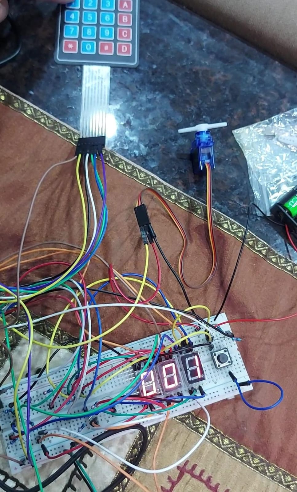

# Servo Motor Controller
An embedded systems project for controlling the angle of a servo-motor using STM32F407 microcontroller, the user inputs the desired angle through a keypad with seven-segments displaying the entered angle

## Hardware Used
- STM32F407 MCU
- Seven Segments
- Mini Servo Motor SG90 9g Servo 180 Degree
- 4x4 Keypad

### A prototype for the device

